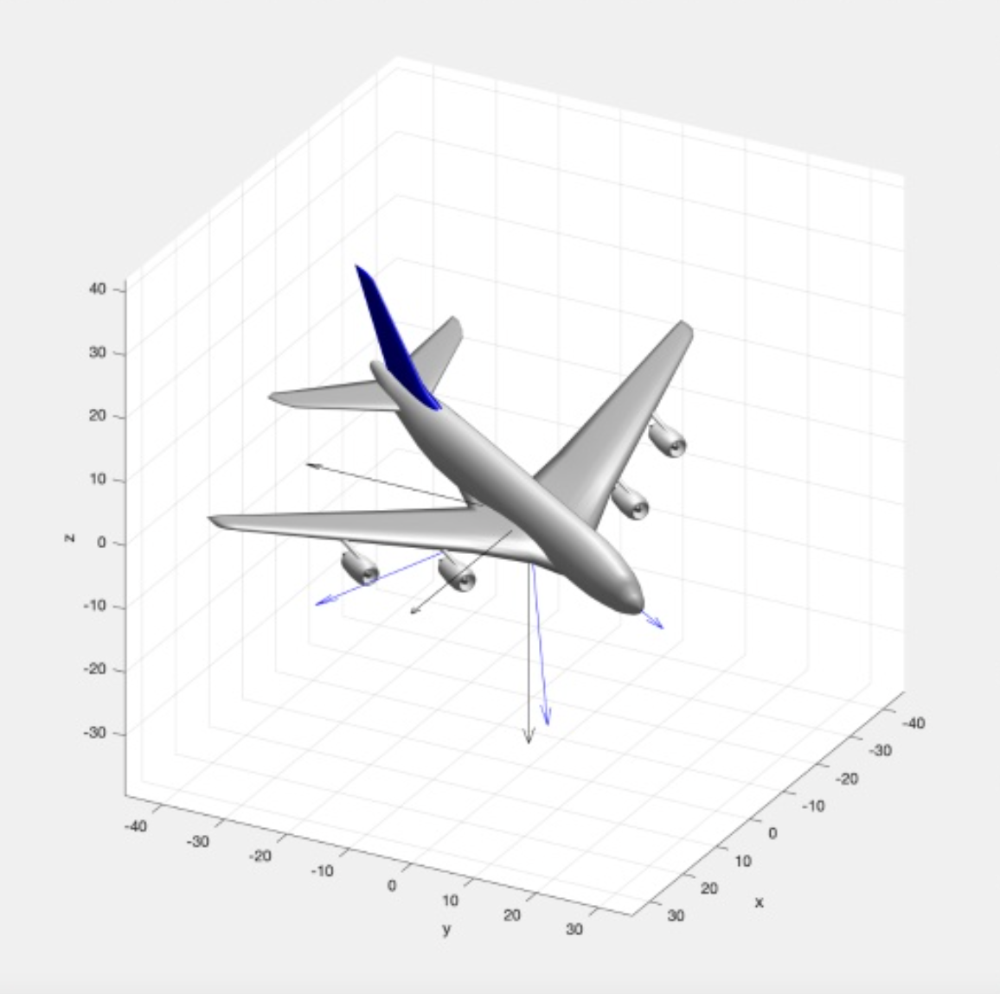
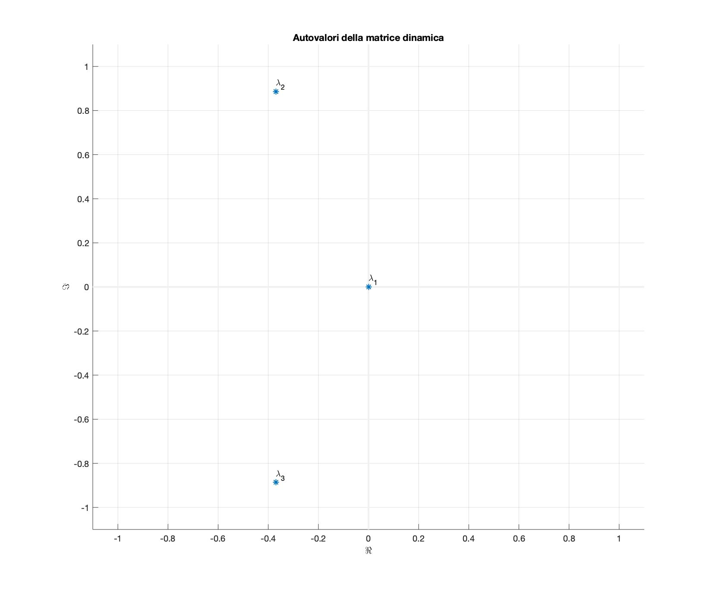
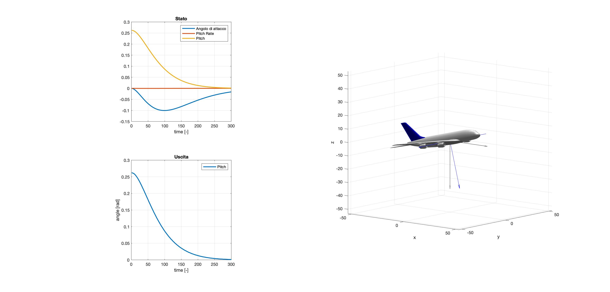
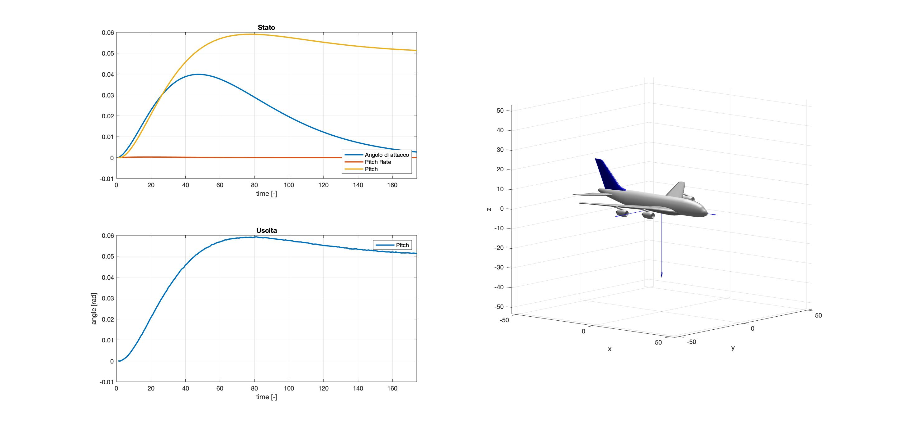
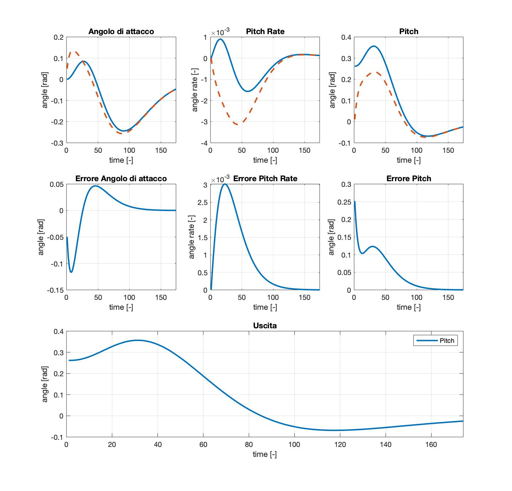
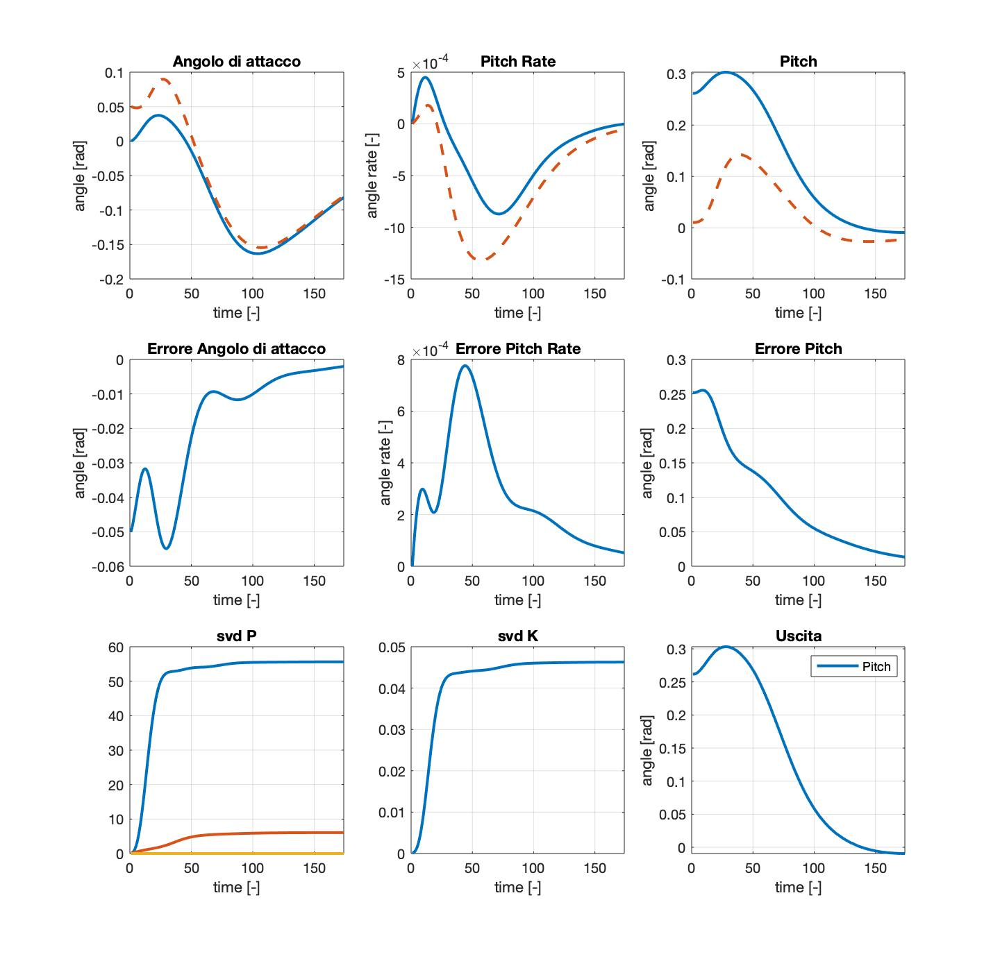

# Aircraft pitch control
Control System for an aircraft in longitudinal motion. Pitch movement control is implemented with state feedback, Luenberger and Kalman observers.

  

# Tasks

1. Characterize the system in terms of eigenvalues, time constants and according to its reachability and observability property.

      

2. A state feedback controller with time constants of about 5s is designed.

      

3. We design an output feedback to be validated with a step reference of 0.05rad, initial conditions
x(0) = [0 0 0]' and sampling step of 100ms.

      

4. Design two observers, one determinsitic and one at Kalman to be validated in a controller-observer structure. Design the two observers such that they have similar behaviors and with initial conditions x(0) = [0.05 0 0.01]'.

    Luenberger:  
      

    Kalman:  
      

# File organization

The repository contains all the files to run the project with MATLAB.

- **output**: output plot.
- *A380.m*: airplane 3D model
- *ALLFUNCS.m*: all implemented functions.
- *Ciclo_Aperto.slx*: open loop Simulink file.
- *log.rtf*: MATLAB console output.
- *main.m*: starting point of the project.